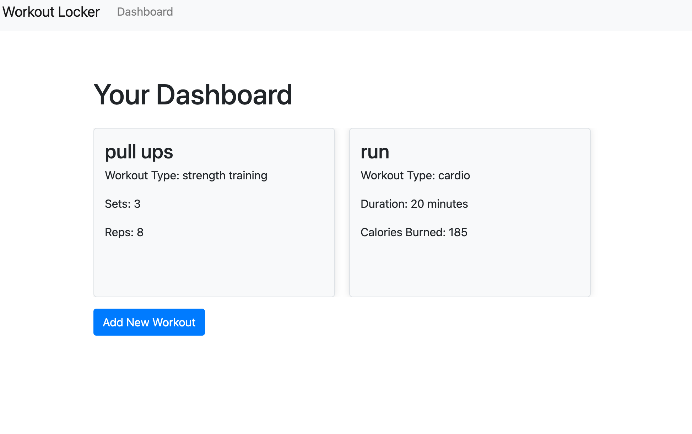

# Workout-Locker

## Description:
Create a user-friendly web application for managing and tracking personal workouts.

## Table of Contents:
- [Usage](#Usage)
- [Install](#Install)
- [What I Learned](#What-I-Learned)
- [Screenshot](#Screeshot)
- [Author](#Author)
- [Acknowledgments](#Acknowledgments)

## Usage
```md
AS A fitness person
I WANT to be able to view and manage my workouts 
SO THAT I can organize and plan my fitness progress
```
## Install
1. Node.js [Version 20.11.0 LTS] https://nodejs.org/en/
2. MySQL2 [Version 3.9.1] https://www.npmjs.com/package/mysql2
3. Inquirer.js [Version 8.2.4](https://www.npmjs.com/package/inquirer/v/8.2.4)
4. Swiper JS [Version 11.0.6] https://swiperjs.com/

## What I Learned
- To build a web-based application that takes in user input to create a database to add, view, and delete workouts. The application prompts the user to sign up with email and password, a function to be select workout type and saves the database in a swipe card format. 

## Screenshot
The following picture shows application example of application:


## Author
Here is my <a href="https://github.com/landonjett/workout-locker.git" target="_blank">Github Repo Link</a>.

## Acknowledgements
- NPM References https://www.npmjs.com/
- MySQL References https://dev.mysql.com/doc/
- W3 Schools Reference https://www.w3schools.com/sql/sql_ref_keywords.asp